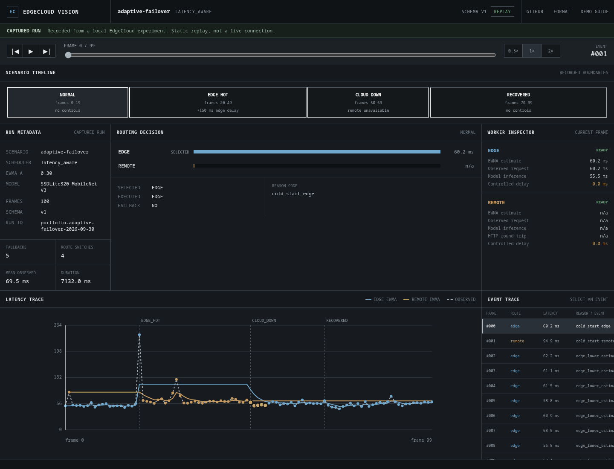

# EdgeCloud Vision Lab

[](https://github.com/nhatminh06/edgecloud-vision-lab/actions/workflows/ci.yml)

EdgeCloud Vision Lab compares computer-vision inference on local and HTTP workers. It includes
six scheduling policies, worker telemetry, controlled failure tests, JSON Lines recording, and a
static viewer for captured runs.

[Open the captured replay](https://nhatminh06.github.io/edgecloud-vision-lab/) ·
[Read the demo guide](docs/demo.md) · [Review the experiment format](docs/experiment-format.md)



The public viewer replays captured experiment data; it does not run inference in the browser.

## Features

- One result type for in-process edge and HTTP remote workers.
- Six scheduler strategies, from strict baselines to health- and telemetry-aware routing.
- Measured model, request, transport, and scheduler timing with explicit metric boundaries.
- Controlled delay and availability changes kept separate from measured performance.
- Typed failure handling with bounded fallback and observable routing decisions.
- JSON Lines experiment recording, replay export, and a tested static viewer.

## Canonical experiment

The replay contains a 100-frame CPU run using SSDLite320 MobileNet V3 Large. It
moves through `normal`, `edge_hot` (+150 ms controlled edge delay), `cloud_down`, and
`recovered` phases. The outage produced five fallback events. Recovery restored remote
availability. Retained EWMA state meant that the scheduler did not switch back to remote.

Both workers shared one machine and the remote path used loopback HTTP. See the
[adaptive-failover experiment note](docs/experiments/adaptive-failover.md) for configuration,
observations, source details, and limitations.

## Architecture

```text
                         +----------------+
frame -----------------> |   Scheduler    |
                         +-------+--------+
                                 |
                    +------------+------------+
                    |                         |
                    v                         v
              EdgeWorker               RemoteWorker
                    |                         | HTTP
                    v                         v
             InferenceEngine          FastAPI service
                                              |
                                              v
                                       InferenceEngine

telemetry + health ----------> scheduler state and routing decisions
results ---------------------> JSONL capture ------> static replay
```

Workers return the same typed result. The engine owns preprocessing, model execution, and
postprocessing; the HTTP layer owns transport schemas; schedulers measure the complete worker
call.

## Scheduler comparison

| Strategy | Latency history | Resource pressure | Health constraint | Fallback |
| --- | --- | --- | --- | --- |
| `edge_only` | No | No | No | No |
| `remote_only` | No | No | No | No |
| `round_robin` | No | No | No | No |
| `latency_aware` | EWMA | No | No | Typed failures |
| `resource_aware` | EWMA | Yes | No | No |
| `resilient` | EWMA | Yes | Yes | Typed failures |

The first three policies are strict baselines. Detailed selection rules, cold-start behavior,
staleness handling, metric semantics, and failure eligibility are documented in
[Scheduler behavior](docs/schedulers.md).

## Quick start

Python 3.12 or newer is required. The first inference run downloads pretrained torchvision
weights to the standard PyTorch cache.

```bash
python3.12 -m venv .venv
source .venv/bin/activate
python -m pip install --upgrade pip
python -m pip install --index-url https://download.pytorch.org/whl/cpu torch torchvision
python -m pip install -e '.[dev]'
```

Run local inference:

```bash
edgecloud-infer --image examples/input.jpg --output outputs/detected.jpg
```

Start the HTTP worker and send it an image:

```bash
edgecloud-serve --host 127.0.0.1 --port 8000
curl http://127.0.0.1:8000/health
edgecloud-remote-infer examples/input.jpg --url http://127.0.0.1:8000
```

Route work through a scheduler:

```bash
edgecloud-run --video examples/input.mp4 \
  --scheduler resilient \
  --remote-url http://127.0.0.1:8000
```

Each processed frame is emitted as JSON Lines with detections, timings, worker identity, and
scheduler metadata. Remote round-trip time is measured by the client and remains distinct from
server phase timings.

## Experiments and replay

Install plotting support, run a repeated scheduler matrix, and export a replay:

```bash
python -m pip install -e '.[dev,experiment]'
edgecloud-experiment --help
edgecloud-export-replay outputs/runs/example.jsonl demo-data/example.json
python -m http.server 8001 --directory site
```

The experiment runner supports warmups, repetitions, controlled worker conditions, aggregate
tables, and plots. The committed viewer dataset is generated from captured JSONL and validated
before export; its values are not hand-edited.

- [Experiment framework](docs/experiments.md)
- [JSONL and replay schema](docs/experiment-format.md)
- [Capture and demo workflow](docs/demo.md)
- [Captured run results](docs/experiments/adaptive-failover.md)

## Deployment

The demo is a static GitHub Pages artifact with no hosted inference backend. Deployment scope,
data flow, and presentation constraints are documented in the
[GitHub Pages demo note](docs/github-pages-demo.md).

## Validation

```bash
ruff format --check .
ruff check .
pytest
python -m pip check
node --check site/app.js
```

## Limitations

- The captured run used one CPU machine for both logical workers.
- Remote measurements use loopback HTTP, not a regional or internet connection.
- Scenario delays and outages are controlled inputs, not naturally occurring load.
- One captured run is not a general hardware, model, scheduler, or cloud benchmark.
- Scheduling is synchronous and does not model a multi-worker request pool.
- Scheduler state is in memory and is not persisted between processes.
- Fallback is bounded to one alternate attempt and only applies to eligible typed failures.

## Documentation

- [Scheduler behavior](docs/schedulers.md)
- [Experiment framework](docs/experiments.md)
- [Experiment and replay format](docs/experiment-format.md)
- [Recorded demo guide](docs/demo.md)
- [Static Pages viewer](docs/github-pages-demo.md)
- [Adaptive-failover run](docs/experiments/adaptive-failover.md)
